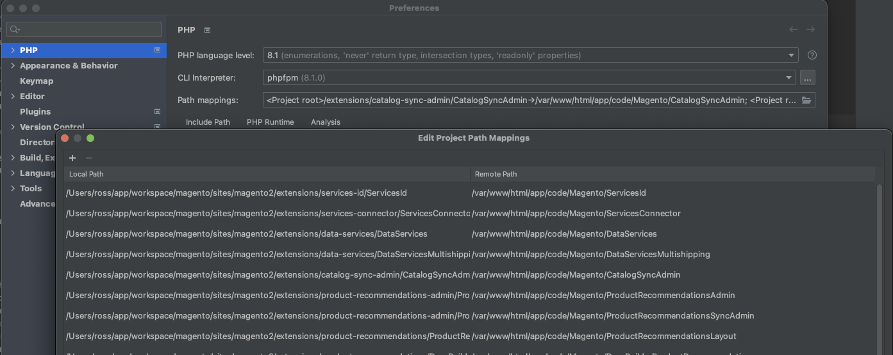

# Data Solutions Docker Magento

This is a customized repository forked from https://github.com/markshust/docker-magento

## Table of Contents

- [Data Solutions Docker Magento](#data-solutions-docker-magento)
  - [Table of Contents](#table-of-contents)
    - [Data Solutions Install Instructions](#data-solutions-install-instructions)
      - [Host Prerequisites](#host-prerequisites)
      - [Templated Install](#templated-install)
    - [CLI Commands](#cli-commands)
  - [Misc Info](#misc-info)
    - [Caching](#caching)
    - [Database](#database)
    - [Composer Authentication](#composer-authentication)
    - [Debug Setup](#debug-setup)
    - [Email / Mailcatcher](#email--mailcatcher)
    - [Redis](#redis)
    - [Xdebug & VS Code](#xdebug--vs-code)
    - [Xdebug & PHPStorm](#xdebug--phpstorm)
    - [SSH](#ssh)
    - [Linux](#linux)
      - [The host.docker.internal hostname](#the-hostdockerinternal-hostname)
      - [Extra settings](#extra-settings)
    - [Blackfire.io](#blackfireio)
    - [MFTF](#mftf)

---

### Data Solutions Install Instructions

#### Host Prerequisites

Although this is a docker solution, your host machine will need the following:

- Docker Desktop
- PHP version 8.1
- Composer version 2
- Composer keys with access to Adobe Commerce (Magento 2 EE/B2B) on repo.magento.com or connect20-qa01.magedevteam.com
  - During the install, you may be prompted to enter these keys. They can be found on your [Marketplace Account](https://marketplace.magento.com/customer/accessKeys/)
- Github Access to the [magento-commerce](https://github.com/magento-commerce) organization

#### Templated Install

Before running, make sure you do not have any server running on ports 80, 443, 3306 or 9000.
If you have apache, nginx, mysql or php-fpm running locally, be sure to stop these services so that install does not fail

```bash
# Download the Docker Compose template into the specified project directory (Ex. magento2)
curl -s https://raw.githubusercontent.com/rossbrandon/docker-magento/main/lib/template | bash -s -- magento2

# Configure env/install.env file to specify Magento version, edition, Magento install source, and if you need Luma sample data
# Example:
#MAGENTO_VERSION=2.4.4
#INSTALL_SOURCE=composer # This is the method used to install Magento only not Data Solutions extensions
#INSTALL_SAMPLE_DATA=true

# Create a DNS host entry for the site
# Default site is magento2.test. You may customize this with the MAGENTO_BASE_URL variable in env/install.env
echo "127.0.0.1 ::1 magento2.test" | sudo tee -a /etc/hosts

# Run the create script to get going!
bin/create

# Open site
open https://magento2.test
```

---

### CLI Commands

- `bin/bash`: Drop into the bash prompt of your Docker container. The `phpfpm` container should be mainly used to access the filesystem within Docker.
- `bin/cache-clean`: Access the [cache-clean](https://github.com/mage2tv/magento-cache-clean) CLI. Note the watcher is automatically started at startup in `bin/start`. Ex. `bin/cache-clean config full_page`
- `bin/cli`: Run any CLI command without going into the bash prompt. Ex. `bin/cli ls`
- `bin/clinotty`: Run any CLI command with no TTY. Ex. `bin/clinotty chmod u+x bin/magento`
- `bin/cliq`: The same as `bin/cli`, but pipes all output to `/dev/null`. Useful for a quiet CLI, or implementing long-running processes.
- `bin/composer`: Run the composer binary. Ex. `bin/composer install`
- `bin/copyfromcontainer`: Copy folders or files from container to host. Ex. `bin/copyfromcontainer vendor`
- `bin/copytocontainer`: Copy folders or files from host to container. Ex. `bin/copytocontainer --all`
- `bin/create`: Downloads, installs, and starts Magento with Data Solutions extensions (currently Product Recommendations and Live Search)
- `bin/cron`: Start or stop the cron service. Ex. `bin/cron start`
- `bin/destroy`: Stops docker containers and prunes containers, networks, and volumes - Use when rebuilding entirely
- `bin/dev-urn-catalog-generate`: Generate URN's for PHPStorm and remap paths to local host. Restart PHPStorm after running this command.
- `bin/devconsole`: Alias for `bin/n98-magerun2 dev:console`
- `bin/devtools-cli-check`: Check & install the CLI devtools if missing from system.
- `bin/download`: Download specific Magento version from Composer to `/var/www/html` directory within the container. Ex. `bin/download 2.4.2 community`
- `bin/fixowns`: This will fix filesystem ownerships within the container.
- `bin/fixperms`: This will fix filesystem permissions within the container.
- `bin/grunt`: Run the grunt binary. Ex. `bin/grunt exec`
- `bin/install-b2b`: Installs Magento B2B
- `bin/install-datasolutions`: Installs Data Solutions extensions to `extensions` directory
- `bin/install-sampledata`: Installs Magento Luma sample data
- `bin/install-src`: Installs Magento code into `src` directory based upon configuration in `.env`
- `bin/magento`: Run the Magento CLI. Ex: `bin/magento cache:flush`
- `bin/mysql`: Run the MySQL CLI with database config from `env/db.env`. Ex. `bin/mysql -e "EXPLAIN core_config_data"` or`bin/mysql < backups/magento.sql`
- `bin/mysqldump`: Backup the Magento database. Ex. `bin/mysqldump > backups/magento.sql`
- `bin/n98-magerun2`: Access the [n98-magerun2](https://github.com/netz98/n98-magerun2) CLI. Ex: `bin/n98-magerun2 dev:console`
- `bin/node`: Run the node binary. Ex. `bin/node --version`
- `bin/npm`: Run the npm binary. Ex. `bin/npm install`
- `bin/pwa-studio`: (BETA) Start the PWA Studio server. Note that Chrome will throw SSL cert errors and not allow you to view the site, but Firefox will.
- `bin/redis`: Run a command from the redis container. Ex. `bin/redis redis-cli monitor`
- `bin/remove`: Remove all containers.
- `bin/removeall`: Remove all containers, networks, volumes, and images.
- `bin/removevolumes`: Remove all volumes.
- `bin/restart`: Stop and then start all containers.
- `bin/root`: Run any CLI command as root without going into the bash prompt. Ex `bin/root apt-get install nano`
- `bin/rootnotty`: Run any CLI command as root with no TTY. Ex `bin/rootnotty chown -R app:app /var/www/html`
- `bin/setup`: Existing script but was customized to fit Data Solutions developer use cases and driven by `env/install.env` configuration
- `bin/setup-grunt`: Install and configure Grunt JavaScript task runner to compile .less files
- `bin/setup-pwa-studio`: (BETA) Install PWA Studio (requires NodeJS and Yarn to be installed on the host machine). Pass in your base site domain, otherwise the default `magento2.test` will be used. Ex: `bin/setup-pwa-studio magento2.test`
- `bin/setup-composer-auth`: Setup authentication credentials for Composer.
- `bin/setup-grunt`: Install and configure Grunt JavaScript task runner to compile .less files
- `bin/setup-pwa-studio`: (BETA) Install PWA Studio (requires NodeJS and Yarn to be installed on the host machine). Pass in your base site domain, otherwise the default `master-7rqtwti-mfwmkrjfqvbjk.us-4.magentosite.cloud` will be used. Ex: `bin/setup-pwa-studio magento2.test`
- `bin/setup-ssl`: Generate an SSL certificate for one or more domains. Ex. `bin/setup-ssl magento2.test foo.test`
- `bin/setup-ssl-ca`: Generate a certificate authority and copy it to the host.
- `bin/start`: Start all containers, good practice to use this instead of `docker-compose up -d`, as it may contain additional helpers.
- `bin/status`: Check the container status.
- `bin/stop`: Stop all containers.
- `bin/update`: Update your project to the most recent version of `docker-magento`.
- `bin/xdebug`: Disable or enable Xdebug. Accepts params `disable` (default) or `enable`. Ex. `bin/xdebug enable`

---

## Misc Info

### Caching

For an improved developer experience, caches are automatically refreshed when related files are updated, courtesy of [cache-clean](https://github.com/mage2tv/magento-cache-clean). This means you can keep all of the standard Magento caches enabled, and this script will only clear the specific caches needed, and only when necessary.

To disable this functionality, uncomment the last line in the `bin/start` file to disable the watcher.

### Database

The hostname of each service is the name of the service within the `docker-compose.yml` file. So for example, MySQL's hostname is `db` (not `localhost`) when accessing it from within a Docker container. Elasticsearch's hostname is `elasticsearch`.

To connect to the MySQL CLI tool of the Docker instance, run:

```
bin/mysql
```

You can use the `bin/mysql` script to import a database, for example a file stored in your local host directory at `magento.sql`:

```
bin/mysql < magento.sql
```

You also can use `bin/mysqldump` to export the database. The file will appear in your local host directory at `magento.sql`:

```
bin/mysqldump > magento.sql
```

> Getting an "Access denied, you need (at least one of) the SUPER privilege(s) for this operation." message when running one of the above lines? Try running it as root with:
> ```
> bin/clinotty mysql -hdb -uroot -pmagento magento < src/backup.sql
> ```
> You can also remove the DEFINER lines from the MySQL backup file with:
> ```
> sed 's/\sDEFINER=`[^`]*`@`[^`]*`//g' -i src/backup.sql
> ```

### Composer Authentication

First setup Magento Marketplace authentication (details in the [DevDocs](http://devdocs.magento.com/guides/v2.0/install-gde/prereq/connect-auth.html)).

Copy `src/auth.json.sample` to `src/auth.json`. Then, update the username and password values with your Magento public and private keys, respectively. Finally, copy the file to the container by running `bin/copytocontainer auth.json`.

---

### Debug Setup

### Email / Mailcatcher

View emails sent locally through Mailcatcher by visiting [http://{yourdomain}:1080](http://{yourdomain}:1080). During development, it's easiest to test emails using a third-party module such as [https://github.com/mageplaza/magento-2-smtp](Mageplaza's SMTP module). Set the mailserver host to `mailcatcher` and port to `1080`.

### Redis

Redis is now the default cache and session storage engine, and is automatically configured & enabled when running `bin/setup` on new installs.

Use the following lines to enable Redis on existing installs:

**Enable for Cache:**

`bin/magento setup:config:set --cache-backend=redis --cache-backend-redis-server=redis --cache-backend-redis-db=0`

**Enable for Full Page Cache:**

`bin/magento setup:config:set --page-cache=redis --page-cache-redis-server=redis --page-cache-redis-db=1`

**Enable for Session:**

`bin/magento setup:config:set --session-save=redis --session-save-redis-host=redis --session-save-redis-log-level=4 --session-save-redis-db=2`

You may also monitor Redis by running: `bin/redis redis-cli monitor`

For more information about Redis usage with Magento, <a href="https://devdocs.magento.com/guides/v2.4/config-guide/redis/redis-session.html" target="_blank">see the DevDocs</a>.

### Xdebug & VS Code

Install and enable the PHP Debug extension from the [Visual Studio Marketplace](https://marketplace.visualstudio.com/items?itemName=felixfbecker.php-debug).

Otherwise, this project now automatically sets up Xdebug support with VS Code. If you wish to set this up manually, please see the [`.vscode/launch.json`](https://github.com/markshust/docker-magento/blame/master/compose/.vscode/launch.json) file.

### Xdebug & PHPStorm

1.  First, install the [Chrome Xdebug helper](https://chrome.google.com/webstore/detail/xdebug-helper/eadndfjplgieldjbigjakmdgkmoaaaoc). After installed, right click on the Chrome icon for it and go to Options. Under IDE Key, select PhpStorm from the list to set the IDE Key to "PHPSTORM", then click Save.

2.  Next, enable Xdebug debugging in the PHP container by running: `bin/xdebug enable`.

3.  Then, open `PhpStorm > Preferences > PHP` and configure:

    * `CLI Interpreter`
        * Create a new interpreter from the `From Docker, Vagrant, VM...` list.
        * Select the Docker Compose option.
        * For Server, select `Docker`. If you don't have Docker set up as a server, create one and name it `Docker`.
        * For Configuration files, add both the `docker-compose.yml` and `docker-compose.dev.yml` files from your project directory.
        * For Service, select `phpfpm`, then click OK.
        * Name this CLI Interpreter `phpfpm`, then click OK again.

    - `Path mappings`
      - Add the following path mappings (`Local Path` -> `Remote Path`):
        - `<path_to_project>/src` -> `/var/www/html`
        - `<path_to_project>/extensions/data-services/DataServices` -> `/var/www/html/app/code/Magento/DataServices`
        - `<path_to_project>/extensions/data-services/DataServicesMultishipping` -> `/var/www/html/app/code/Magento/DataServicesMultishipping`
        - `<path_to_project>/extensions/services-id/ServicesId` -> `/var/www/html/app/code/Magento/ServicesId`
        - `<path_to_project>/extensions/services-id/ServicesIdGraphQlServer` -> `/var/www/html/app/code/Magento/ServicesIdGraphQlServer`
        - `<path_to_project>/extensions/services-id/ServicesIdLayout` -> `/var/www/html/app/code/Magento/ServicesIdLayout`
        - `<path_to_project>/extensions/services-connector/ServicesConnector` -> `/var/www/html/app/code/Magento/ServicesConnector`
        - `<path_to_project>/extensions/product-recommendations/ProductRecommendations` -> `/var/www/html/app/code/Magento/ProductRecommendations`
        - `<path_to_project>/extensions/product-recommendations/ProductRecommendationsLayout` -> `/var/www/html/app/code/Magento/ProductRecommendationsLayout`
        - `<path_to_project>/extensions/product-recommendations/PageBuilderProductRecommendations` -> `/var/www/html/app/code/Magento/PageBuilderProductRecommendations`
        - `<path_to_project>/extensions/product-recommendations/VisualProductRecommendations` -> `/var/www/html/app/code/Magento/VisualProductRecommendations`
        - `<path_to_project>/extensions/product-recommendations-admin/ProductRecommendationsAdmin` -> `/var/www/html/app/code/Magento/ProductRecommendationsAdmin`
        - `<path_to_project>/extensions/product-recommendations-admin/ProductRecommendationsSyncAdmin` -> `/var/www/html/app/code/Magento/ProductRecommendationsSyncAdmin`
        - `<path_to_project>/extensions/catalog-sync-admin/CatalogSyncAdmin` -> `/var/www/html/app/code/Magento/CatalogSyncAdmin`
        - `<path_to_project>/extensions/commerce-data-export/BundleProductDataExporter` -> `/var/www/html/app/code/Magento/BundleProductDataExporter`
        - `<path_to_project>/extensions/commerce-data-export/CatalogDataExporter` -> `/var/www/html/app/code/Magento/CatalogDataExporter`
        - `<path_to_project>/extensions/commerce-data-export/CatalogInventoryDataExporter` -> `/var/www/html/app/code/Magento/CatalogInventoryDataExporter`
        - `<path_to_project>/extensions/commerce-data-export/CatalogUrlRewriteDataExporter` -> `/var/www/html/app/code/Magento/CatalogUrlRewriteDataExporter`
        - `<path_to_project>/extensions/commerce-data-export/ConfigurableProductDataExporter` -> `/var/www/html/app/code/Magento/ConfigurableProductDataExporter`
        - `<path_to_project>/extensions/commerce-data-export/DataExporter` -> `/var/www/html/app/code/Magento/DataExporter`
        - `<path_to_project>/extensions/commerce-data-export/QueryXml` -> `/var/www/html/app/code/Magento/QueryXml`
        - `<path_to_project>/extensions/commerce-data-export/ParentProductDataExporter` -> `/var/www/html/app/code/Magento/ParentProductDataExporter`
        - `<path_to_project>/extensions/commerce-data-export/ProductVariantDataExporter` -> `/var/www/html/app/code/Magento/ProductVariantDataExporter`
        - `<path_to_project>/extensions/commerce-data-export-ee/ProductOverrideDataExporter` -> `/var/www/html/app/code/Magento/ProductOverrideDataExporter`
        - `<path_to_project>/extensions/saas-export/SaaSCatalog` -> `/var/www/html/app/code/Magento/SaaSCatalog`
        - `<path_to_project>/extensions/saas-exportSaaSCommon` -> `/var/www/html/app/code/Magento/SaaSCommon`
        - `<path_to_project>/extensions/magento-live-search/LiveSearch` -> `/var/www/html/app/code/Magento/LiveSearch`
        - `<path_to_project>/extensions/magento-live-search/LiveSearchAdapter` -> `/var/www/html/app/code/Magento/LiveSearchAdapter`
        - `<path_to_project>/extensions/magento-live-search/LiveSearchMetrics` -> `/var/www/html/app/code/Magento/LiveSearchMetrics`
        - `<path_to_project>/extensions/magento-live-search/LiveSearchStorefrontPopover` -> `/var/www/html/app/code/Magento/LiveSearchStorefrontPopover`
        - `<path_to_project>/extensions/magento-live-search/LiveSearchTerms` -> `/var/www/html/app/code/Magento/LiveSearchTerms`
        - `<path_to_project>/extensions/data-solutions-magento-bff/GraphQlServer` -> `/var/www/html/app/code/Magento/GraphQlServer`
        - `<path_to_project>/extensions/data-solutions-magento-bff/AdminGraphQlServer` -> `/var/www/html/app/code/Magento/AdminGraphQlServer`
        - `<path_to_project>/extensions/data-solutions-magento-bff/ExternalSchemaGraphQlServer` -> `/var/www/html/app/code/Magento/ExternalSchemaGraphQlServer`



1. Open `PHPStorm > Preferences > Languages & Frameworks > PHP > Debug` and set Debug Port to `9000,9003`.

2. Open `PHPStorm > Preferences > Languages & Frameworks > PHP > DBGp Proxy` and set Port to `9001`.

3. Open `PHPStorm > Preferences > Languages & Frameworks > PHP > Servers` and create a new server:

   - Set Name and Host to your domain name (ex. `magento2.test`)
   - Keep port set to `80`
   - Check the Path Mappings box
   - Add the following path mappings (to match the volume bindings from step 3c above):
     - `./src` -> `/var/www/html`
     - `./extensions/data-services/DataServices` -> `/var/www/html/app/code/Magento/DataServices`
     - `./extensions/data-services/DataServicesMultishipping` -> `/var/www/html/app/code/Magento/DataServicesMultishipping`
     - `./extensions/services-id/ServicesId` -> `/var/www/html/app/code/Magento/ServicesId`
     - `./extensions/services-id/ServicesIdGraphQlServer` -> `/var/www/html/app/code/Magento/services-id/ServicesIdGraphQlServer`
     - `./extensions/services-id/ServicesIdLayout` -> `/var/www/html/app/code/Magento/services-id/ServicesIdLayout`
     - `./extensions/services-connector/ServicesConnector` -> `/var/www/html/app/code/Magento/services-connector/ServicesConnector`
     - `./extensions/product-recommendations/ProductRecommendations` -> `/var/www/html/app/code/Magento/ProductRecommendations`
     - `./extensions/product-recommendations/ProductRecommendationsLayout` -> `/var/www/html/app/code/Magento/ProductRecommendationsLayout`
     - `./extensions/product-recommendations/PageBuilderProductRecommendations` -> `/var/www/html/app/code/Magento/PageBuilderProductRecommendations`
     - `./extensions/product-recommendations/VisualProductRecommendations` -> `/var/www/html/app/code/Magento/VisualProductRecommendations`
     - `./extensions/product-recommendations-admin/ProductRecommendationsAdmin` -> `/var/www/html/app/code/Magento/ProductRecommendationsAdmin`
     - `./extensions/product-recommendations-admin/ProductRecommendationsSyncAdmin` -> `/var/www/html/app/code/Magento/ProductRecommendationsSyncAdmin`
     - `./extensions/catalog-sync-admin/CatalogSyncAdmin` -> `/var/www/html/app/code/Magento/CatalogSyncAdmin`
     - `./extensions/commerce-data-export/app/code/Magento/BundleProductDataExporter` -> `/var/www/html/app/code/Magento/BundleProductDataExporter`
     - `./extensions/commerce-data-export/app/code/Magento/CatalogDataExporter` -> `/var/www/html/app/code/Magento/CatalogDataExporter`
     - `./extensions/commerce-data-export/app/code/Magento/CatalogInventoryDataExporter` -> `/var/www/html/app/code/Magento/CatalogInventoryDataExporter`
     - `./extensions/commerce-data-export/app/code/Magento/CatalogUrlRewriteDataExporter` -> `/var/www/html/app/code/Magento/CatalogUrlRewriteDataExporter`
     - `./extensions/commerce-data-export/app/code/Magento/ConfigurableProductDataExporter` -> `/var/www/html/app/code/Magento/ConfigurableProductDataExporter`
     - `./extensions/commerce-data-export/app/code/Magento/DataExporter` -> `/var/www/html/app/code/Magento/DataExporter`
     - `./extensions/commerce-data-export/app/code/Magento/ParentProductDataExporter` -> `/var/www/html/app/code/Magento/ParentProductDataExporter`
     - `./extensions/commerce-data-export/app/code/Magento/ProductVariantDataExporter` -> `/var/www/html/app/code/Magento/ProductVariantDataExporter`
     - `./extensions/commerce-data-export-ee/app/code/Magento/ProductOverrideDataExporter` -> `/var/www/html/app/code/Magento/ProductOverrideDataExporter`
     - `./extensions/saas-export/app/code/Magento/SaaSCatalog` -> `/var/www/html/app/code/Magento/SaaSCatalog`
     - `./extensions/saas-export/app/code/Magento/SaaSCommon` -> `/var/www/html/app/code/Magento/SaaSCommon`
     - `./extensions/magento-live-search/app/code/Magento/LiveSearch` -> `/var/www/html/app/code/Magento/LiveSearch`
     - `./extensions/magento-live-search/app/code/Magento/LiveSearchAdapter` -> `/var/www/html/app/code/Magento/LiveSearchAdapter`
     - `./extensions/magento-live-search/app/code/Magento/LiveSearchMetrics` -> `/var/www/html/app/code/Magento/LiveSearchMetrics`
     - `./extensions/magento-live-search/app/code/Magento/LiveSearchStorefrontPopover` -> `/var/www/html/app/code/Magento/LiveSearchStorefrontPopover`
     - `./extensions/magento-live-search/app/code/Magento/LiveSearchTerms` -> `/var/www/html/app/code/Magento/LiveSearchTerms`
     - `./extensions/data-solutions-magento-bff/GraphQlServer` -> `/var/www/html/app/code/Magento/GraphQlServer`
     - `./extensions/data-solutions-magento-bff/AdminGraphQlServer` -> `/var/www/html/app/code/Magento/AdminGraphQlServer`
     - `./extensions/data-solutions-magento-bff/ExternalSchemaGraphQlServer` -> `/var/www/html/app/code/Magento/ExternalSchemaGraphQlServer`


1. Go to `Run > Edit Configurations` and create a new `PHP Remote Debug` configuration by clicking the plus sign and selecting it. Set the Name to your domain (ex. `magento2.test`). Check the `Filter debug connection by IDE key` checkbox, select the server you just setup, and under IDE Key enter `PHPSTORM`. This IDE Key should match the IDE Key set by the Chrome Xdebug Helper. Then click OK to finish setting up the remote debugger in PHPStorm.

2. Open up `src/pub/index.php`, and set a breakpoint near the end of the file. Go to `Run > Debug 'magento2.test'`, and open up a web browser. Ensure the Chrome Xdebug helper is enabled by clicking on it > Debug. Navigate to your Magento store URL, and Xdebug within PHPStorm should now trigger the debugger and pause at the toggled breakpoint.

### SSH

Since version `40.0.0`, this project supports connecting to Docker with SSH/SFTP. This means that if you solely use either PhpStorm or VSCode, you no longer need to selectively mount host volumes in order to gain bi-directional sync capabilities from host to container. This will enable full speed in the native filesystem, as all files will be stored directly in the `appdata` container volume, rather than being synced from the host. This is especially useful if you'd like to sync larger directories such as `generated`, `pub` & `vendor`.

Copy `docker-compose.dev-ssh.yml` to `docker-compose.dev.yml` before installing Magento to take advantage of this setup. Then, create an SFTP connection at  Preferences -> Build, Execution, Deployment -> Deployment. Connect to `localhost` and use `app` for the username & password. You can set additional options for working with Magento in PhpStorm at Preferences -> Build, Execution, Deployment -> Deployment -> Options.

Note that you must use your IDE's SSH/SFTP functionality, otherwise changes will not be synced. To re-sync your host environment at any time, run:

```
bin/copyfromcontainer --all
```

### Linux

Running Docker on Linux should be pretty straight-forward. Note that you need to run some [post install commands](https://docs.docker.com/install/linux/linux-postinstall/) as well as [installing Docker Compose](https://docs.docker.com/compose/install/) before continuing. These steps are taken care of automatically with Docker Desktop, but not on Linux.

Copy `docker-compose.dev-linux.yml` to `docker-compose.dev.yml` before installing Magento to take advantage of this setup.

#### The host.docker.internal hostname

The `host.docker.internal` hostname is used on Docker for Mac/Windows to reference the Docker daemon. On Linux, this hostname does not exist.

This hostname is [hard-coded in the php.ini file](https://github.com/markshust/docker-magento/blob/master/images/php/7.4/conf/php.ini#L8). To make this hostname resolve, add `"host.docker.internal:172.17.0.1"` to the `app.extra_hosts` parameter of `docker-compose.yml`, replacing `172.17.0.1` with the result of:

```
docker run --rm alpine ip route | awk 'NR==1 {print $3}'
```

You must also create a new entry in your `/etc/hosts` file using the same IP:

```
172.17.0.1 host.docker.internal
```

#### Extra settings

To enable Xdebug on Linux, you may also need to open port 9003 on the firewall by running:

```
sudo iptables -A INPUT -p tcp --dport 9003 -j ACCEPT
```

You may also have to increase a virtual memory map count on the host system which is required by [Elasticsearch](https://www.elastic.co/guide/en/elasticsearch/reference/current/vm-max-map-count.html).

Add the following line to the `/etc/sysctl.conf` file on your host:

```
vm.max_map_count=262144
```

### Blackfire.io

These docker images have built-in support for Blackfire.io. To use it, first register your server ID and token with the Blackfire agent:

```
bin/root blackfire-agent --register --server-id={YOUR_SERVER_ID} --server-token={YOUR_SERVER_TOKEN}
```

Next, open up the `bin/start` helper script and uncomment the line:

```
#bin/root /etc/init.d/blackfire-agent start
```

Finally, restart the containers with `bin/restart`. After doing so, everything is now configured and you can use a browser extension to profile your Magento store with Blackfire.

### MFTF

To work with MFTF you will need to first enable the `selenium` image in the `docker-compose.dev.yml` file. Then, you will need to run the following.

1. Run mftf build process `bin/mftf build:project`. This should build the basic setup for mftf in your project.
2. Update the `extra_host` values to match your Magento URL and IP in `docker-compose.dev.yml`.
3. Update the values in `src/dev/tests/acceptance/.env`, including adding the new line `SELENIUM_HOST=selenium` to define the host Codeception should connect to.
4. Run a sample test `bin/mftf run:test AdminLoginSuccessfulTest`.
5. Update your `nginx.conf` file to allow access to the dev section with the following, before the final `deny all` section:

```
location ~* ^/dev/tests/acceptance/utils($|/) {
    root $MAGE_ROOT;
    location ~ ^/dev/tests/acceptance/utils/command.php {
        fastcgi_pass   fastcgi_backend;
        fastcgi_index  index.php;
        fastcgi_param  SCRIPT_FILENAME  $document_root$fastcgi_script_name;
        include        fastcgi_params;
    }
}
```

---

[Original Repo Documentation](https://github.com/markshust/docker-magento/blob/master/README.md)
